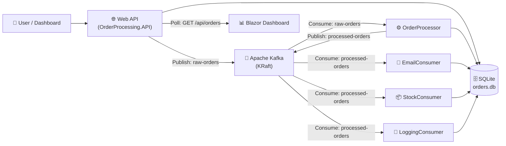

# OrderProcessing — Async Event-Driven Order System

[](https://dotnet.microsoft.com/)
[](https://kafka.apache.org/)
[](https://learn.microsoft.com/ef/core/)
[](https://dotnet.microsoft.com/apps/aspnet/web-apps/blazor)

A demonstration of **asynchronous programming** and **event-driven architecture** using .NET 10 and Apache Kafka. Orders are created via a Web API, published to Kafka topics, and processed asynchronously by multiple background worker services.

> **Purpose:** GitHub portfolio project showcasing async/await patterns, message brokers, background services, and real-time monitoring.
>
> **Key Pattern:** API → Kafka → Pipeline of Workers → Dashboard

---

## Architecture



### Pipeline Flow

```
Order Created (Pending)
    │
    ▼
┌─────────────────────────────────────────────┐
│  API: Validate input → Save to DB →         │
│        Publish to "raw-orders" → 202 Accepted│
└─────────────────────────────────────────────┘
    │
    ▼
┌─────────────────────────────────────────────┐
│  OrderProcessor:                             │
│    1. Consume "raw-orders"                   │
│    2. Mark as Processing                     │
│    3. Validate business rules                │
│    4. Calculate TotalPrice                   │
│    5. Mark as Processed                      │
│    6. Publish to "processed-orders"          │
└─────────────────────────────────────────────┘
    │
    ▼
    ┌─────────────────┬─────────────────┬─────────────────┐
    ▼                 ▼                 ▼
┌──────────┐   ┌──────────┐   ┌──────────────┐
│ Email    │   │ Stock    │   │ Logging      │
│ Consumer │   │ Consumer │   │ Consumer     │
│          │   │          │   │              │
│ Send     │   │ Deduct   │   │ Audit log    │
│ email    │   │ stock    │   │ to console   │
└──────────┘   └──────────┘   └──────────────┘
    │                 │                 │
    └─────────────────┴─────────────────┘
                    │
                    ▼
            Order Status: Processed ✅
```

---

## Tech Stack

| Layer             | Technology                                       |
|-------------------|--------------------------------------------------|
| Runtime           | .NET 10                                          |
| API               | ASP.NET Core Web API (Controllers)               |
| UI                | Blazor Server (Interactive Server Rendering)     |
| ORM               | Entity Framework Core + SQLite                   |
| Message Broker    | Apache Kafka (KRaft mode, no Zookeeper)          |
| Kafka Client      | Confluent.Kafka 2.15+                            |
| API Docs          | Scalar (modern Swagger alternative)              |
| Background Jobs   | Worker Services (IHostedService / BackgroundService) |
| Database          | SQLite (shared file, `data/orders.db`)           |
| Containerization  | Docker Compose                                   |

---

## Project Structure

```
Async Programming/
├── docker/
│   └── docker-compose.yml          # Kafka (KRaft)
├── src/
│   ├── OrderProcessing.Core/       # Shared models, EF DbContext, Kafka config
│   │   ├── Models/                 # Order, OrderItem, OrderStatus
│   │   ├── Data/                   # OrderDbContext
│   │   └── Configuration/          # KafkaTopics, KafkaSettings
│   ├── OrderProcessing.API/        # Web API (Producer) + Blazor Server UI
│   │   ├── Controllers/            # OrdersController (POST/GET)
│   │   ├── Services/               # OrderPublisherService, KafkaTopicInitializer
│   │   ├── Dtos/                   # CreateOrderRequest, OrderStatusResponse
│   │   └── Components/             # Blazor pages (Orders, OrderDetail, NewOrder)
│   ├── OrderProcessing.OrderProcessor/  # Main processing worker
│   ├── OrderProcessing.EmailConsumer/   # Email simulation worker
│   ├── OrderProcessing.StockConsumer/   # Stock deduction simulation
│   └── OrderProcessing.LoggingConsumer/ # Audit logging worker
├── docs/screenshots/               # PR screenshots
├── data/                           # SQLite database (gitignored)
├── .gitignore
├── CONTEXT.md                      # Decision log
└── README.md
```

---

## Getting Started

### Prerequisites

- [.NET 10 SDK](https://dotnet.microsoft.com/download/dotnet/10.0)
- [Docker Desktop](https://www.docker.com/products/docker-desktop/) (for Kafka)

### 1. Start Kafka

```bash
docker compose -f docker/docker-compose.yml up -d
```

Verify it's running:

```bash
docker ps --format "table {{.Names}}\t{{.Status}}\t{{.Ports}}" | grep kafka
```

### 2. Start the API

```bash
dotnet run --project src/OrderProcessing.API/ --urls "https://localhost:5001"
```

- **Blazor Dashboard:** https://localhost:5001/orders
- **Scalar API Docs:** https://localhost:5001/scalar

### 3. Start the Workers (separate terminals)

```bash
# Order Processor — main processing engine
dotnet run --project src/OrderProcessing.OrderProcessor/

# Email Consumer — sends email notifications
dotnet run --project src/OrderProcessing.EmailConsumer/

# Stock Consumer — manages inventory
dotnet run --project src/OrderProcessing.StockConsumer/

# Logging Consumer — audit trail
dotnet run --project src/OrderProcessing.LoggingConsumer/
```

---

## API Endpoints

| Method | Endpoint | Description | Response |
|--------|----------|-------------|----------|
| `POST` | `/api/orders` | Submit a new order (async) | `202 Accepted` + tracking URL |
| `GET` | `/api/orders` | List all orders (optional `?status=Pending`) | `200 OK` |
| `GET` | `/api/orders/{id}` | Get order details (with items) | `200 OK` / `404` |
| `GET` | `/api/orders/{id}/status` | Lightweight status check | `200 OK` |

### Example: Create an Order

```bash
curl -sk -X POST "https://localhost:5001/api/orders" \
  -H "Content-Type: application/json" \
  -d '{
    "customerName": "Alice Smith",
    "customerEmail": "alice@example.com",
    "items": [
      {"productName": "Laptop", "unitPrice": 25000, "quantity": 1},
      {"productName": "Mouse", "unitPrice": 500, "quantity": 2}
    ]
  }'
```

Response (202 Accepted):

```json
{
  "id": "c0f35649-...",
  "status": 0,
  "message": "Order submitted for processing. Use the tracking URL to check status.",
  "trackingUrl": "https://localhost:5001/api/Orders/c0f35649-..."
}
```

### Example: Track Order Status

```bash
curl -sk "https://localhost:5001/api/orders/c0f35649-..." | python3 -m json.tool
```

After a few seconds:

```json
{
  "id": "c0f35649-...",
  "status": 2,
  "totalPrice": 26000,
  "items": [
    { "productName": "Laptop", "unitPrice": 25000, "quantity": 1, "subTotal": 25000 }
  ],
  "customerName": "Alice Smith",
  "createdAt": "2026-07-18T21:45:13.911306Z",
  "updatedAt": "2026-07-18T21:45:13.924678Z"
}
```

> `status: 0` = Pending → `status: 1` = Processing → `status: 2` = Processed → `status: 3` = Failed

---

## Order Lifecycle

| Status      | Description                              | Trigger                  |
|-------------|------------------------------------------|--------------------------|
| `Pending`   | Order created, awaiting processing       | API saves + publishes    |
| `Processing`| Being validated and calculated           | OrderProcessor worker    |
| `Processed` | Successfully processed (total calculated)| OrderProcessor worker    |
| `Failed`    | Validation failed or system error        | OrderProcessor worker    |

---

## Dashboard

The Blazor Server dashboard provides:

- **Orders List** — Live-updating table with color-coded status badges (3s auto-refresh)
- **Order Detail** — Full order breakdown with items and pipeline status
- **New Order Form** — Create orders with dynamic line items

Open https://localhost:5001/orders in your browser.

---

## Development History

This project was built incrementally across phases to demonstrate a real-world sync-to-async migration:

| Phase | Description | Key Learning |
|-------|-------------|--------------|
| **1** | Project scaffold, Docker, Core models | .NET solution structure, EF Core, Kafka setup |
| **2** | Web API + Blazor Dashboard | REST API design, Scalar docs, SQLite |
| **3** | Kafka workers (OrderProcessor, Email, Stock, Logging) | Event-driven architecture, consumer groups |
| **4** | **PR: Sync → Async conversion** | 202 Accepted pattern, pipeline redesign |
| **5** | Documentation & polish | README, portfolio presentation |

Phase 4 was delivered as a **[GitHub Issue → Pull Request](https://github.com/serfirazab/OrderProcessing/issues/1)** workflow, simulating a real team code review process:

- **Issue:** "Convert order processing from synchronous to fully asynchronous"
- **Change:** API returns 202 Accepted, calculation moved to OrderProcessor
- **Merge:** Squash merge from `feature/async-order-processing` → `develop`

---


## Key Concepts Demonstrated

- **Async/Await** — Non-blocking I/O across the entire pipeline
- **Event-Driven Architecture** — Kafka topics decouple producers from consumers
- **Background Services** — Long-running workers with graceful shutdown
- **At-Least-Once Delivery** — Manual Kafka commit after successful processing
- **Database per Service** — Shared SQLite database with independent DbContext
- **202 Accepted Pattern** — Async request handling with polling-based status tracking
- **Blazor Server** — Interactive UI with SignalR circuit and auto-refresh
- **Docker + KRaft** — Modern Kafka deployment without Zookeeper
- **Git Flow** — Feature branches, Issue-driven development, PR workflow

---

## License

MIT — Built for portfolio demonstration purposes.
